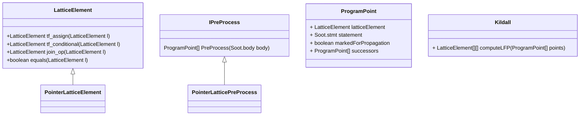
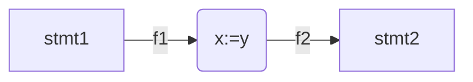
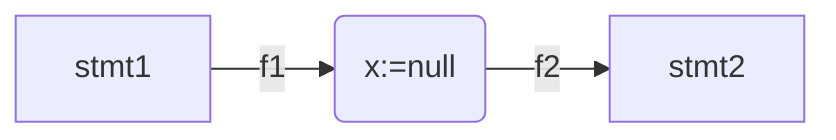
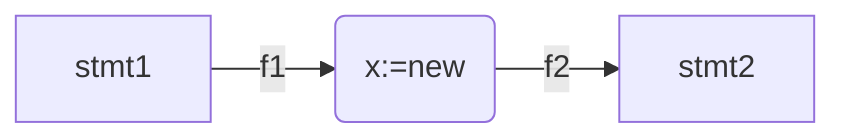
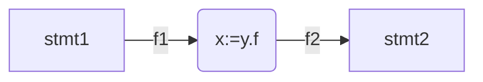
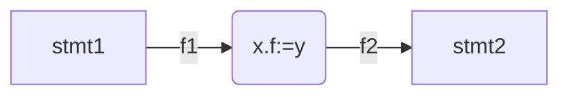
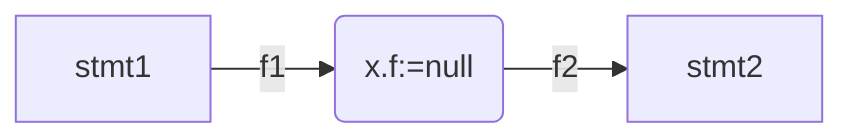

[[_TOC_]]

# Null dereference analysis

## Pre-requisites

To run,

-   Java 8 SDK
-   Make build tool (Available in linux)

## Phase 1 (Intraprocedural analysis)

### Build

Make sure the pre-requisites are available on your system.
Run `make` from the main directory of this repository.

Please see `README.org` for more details on build.

### Usage

#### Direct

The analysis can be run directly from the command line, provided the java runtime is available on the system.

First add the soot packages to the class path using the command
`source environ.sh`

then use the following command to run the analysis. Here

-   `<target-folder>` is the directory where the java source file on which analysis is to be done resides.
-   `<main-class>` is the name of the class file within the target-folder
-   `<target-class>` is the class in the main-class file
-   `<target-method>` is the method on which the intra-procedural analysis will be done
    `java Analysis.java <target-folder> <main-class> <target-class> <target-method>`

#### Running tests

The `expected-output` directory has some of the tests that were manually verified. In order to run all the tests execute

`./run-all-tests.sh`
This executes all the tests and compares the output file with the one in expected-output folder.

You can run a specific test on one function by executing

`./run-one-test.sh <function-name>`

the scripts assume that the function is available in `target2-mine/BasicTest.java`

### Code structure

#### IPreProcess

-   This interface is for preprocessors for particular lattice elements. It can be implemented based on the type of lattice being used for the analysis.

#### PointerLatticePreProcess

-   This is the implementation of IPreProcess for pointer lattice. Here we gather all the local variables and create an empty map, and also for each statement, the input facts are structured using the ProgramPoint class.

#### ProgramPoint

-   This class is to represent the program point, in Kildall's algorithm. Each program point has a statement, input fact, a flag to check whether its marked for propagation and the successor program points (which is obtained from the graph representation of the body).

#### Kildall

-   This class has just one static function to compute the least fixpoint. Given an input list of program points(This can be any latticeElement, which is instantiated based on the analysis type in main), it return list of list of program points.
-   The first element is always the final list of program points of the algorithm (The actual fixpoint).
-   The remaining elements are output at each iteration of the algorithm.

### PointerLatticeElement - implementation

#### Lattice Definition

$PseudoVar$: This is the set of all allocation sites in the program. For example conider the following line in jimple

`10: x := new BasicTest`

The RHS in this assignment is treated as a pseudo-variable. The token used to represent pseudo variable is `new<lineNumber>`, in this example `new BasicTest` would be represented as `new10`

Let $Var'=\{null\}\cup PseudoVar$ and $Field$ be the set of all field of any class in the program.

Set of all elements in lattice is defined as
$$PointerLattice:=(Var\to 2^{Var'})\bigcup (PseudoVar\times Field \to 2^{Var'})$$

In code, the state of PointerLatticeElement is stored as a `Map<String, HashSet<String>>`. HashSet is used in order for easy updation (no need to worry about duplicates).

#### Join operation

Let $f_1, f_2\in PointerLattice$, then

$$f_1 \sqcup f_2 = \lambda v.(f_1(v)\cup f_2(v)) \bigcup \lambda (v_1.f).(f_1(v_1.f)\cup f_2(v_1.f))$$

#### Transfer function - assignment

Strong updates, whenever lhs is of some reference type.

$$f_2 = \text{tf\_assign}(f_1)=f_1[x\to f_1(y)]$$

$$f_2 = \text{tf\_assign}(f_1)=f_1[x\to \{null\}]$$

$$f_2 = \text{tf\_assign}(f_1)=f_1[x\to \{new_{lineNumber}\}]$$

$$f_2 = \text{tf\_assign}(f_1)=f_1[x\to \bigcup_{e\in f_1(y).f} e]$$

Weak updates for all the field type assignments

$$f_2 = \text{tf\_assign}(f_1)=f_1[x_1.f\to f_1(x_1.f)\cup f_1(y)]...[x_n.f\to f_1(x_n.f)\cup f_1(y)]$$

where $f_1(x) = \{x_1, ..., x_n\}$

$$f_2 = \text{tf\_assign}(f_1)=f_1[x_1.f\to f_1(x_1.f)\cup null]...[x_n.f\to f_1(x_n.f)\cup null]$$

$$f_2 = \text{tf\_assign}(f_1)=f_1[x_1.f\to f_1(x_1.f)\cup null]...[x_n.f\to f_1(x_n.f)\cup new_{lineNumber}]$$

In Jimple, `x.f=y.f` is not possible.
